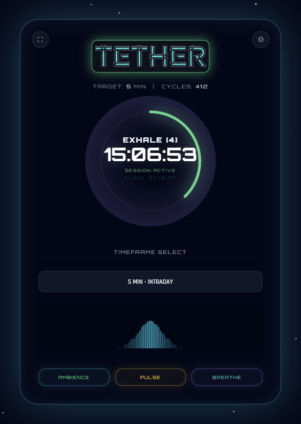

# TETHER
> **Mindful Performance & Focusing Tool**

**TETHER** is a cybernetic grounding tool designed to prevent cognitive spiraling. It synchronizes your nervous system with market time, anchoring your attention to the present moment ("Zero Point") through precise audio-visual cues.

## Core Modules

### 1. Candle Synchronization
Unlike standard timers, Tether aligns with the **Global Candle Close**. 
- If you select **5 MIN** at `10:02`, the timer targets `10:05`, not `10:07`.
- This keeps you perfectly synced with the market rhythm.

### 2. Bio-Sync Breathing Assistant
An active regulation system for your internal state.
- **Ghost Ring**: A subtle visual guide that expands and contracts.
- **Command Text**: Explicit "INHALE / HOLD" instructions inside the ring.
- **Audio Modulation**: The brown noise "Focus Shield" brightens on inhale and muffles on exhale, creating an immersive "Ocean Breath" effect.

### 3. Sonic Anchors
Procedural audio cues allow you to stay lucid without constant screen checking.
- **Minute Beep**: A subtle check-in every 60s.
- **Alert (Yellow)**: Warning 5s before candle close.
- **Focus Shield (Brown Noise)**: A masking layer to block external distractions.

## Usage
Simply open `index.html` in any modern web browser (Chrome, Edge, Safari).
No installation required.

---
*Built for High-Performance Trading*
