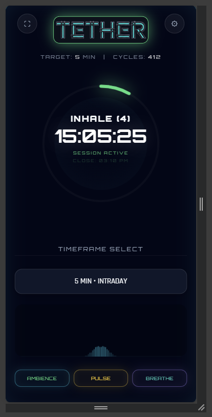
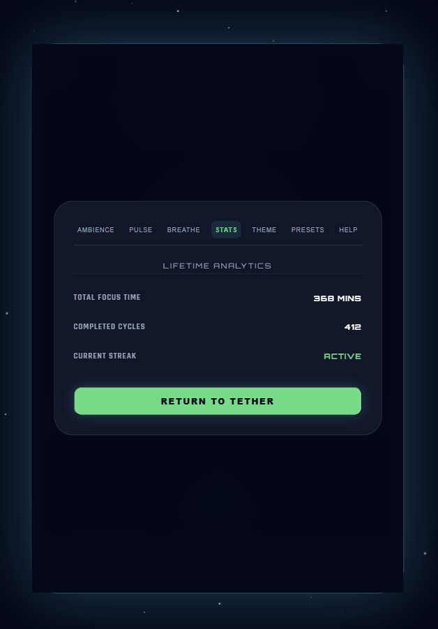
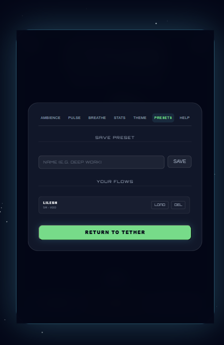
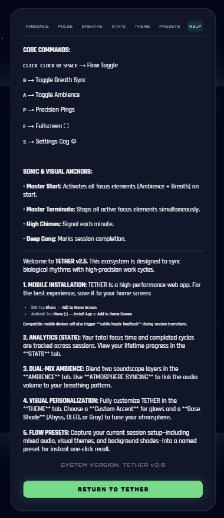

# TETHER v2.5: Mindful Performance Ecosystem 🌀

TETHER is a high-precision focus application designed to synchronize biological rhythms with deep-work cycles. It combines minimalist aesthetics with sophisticated audio-visual anchors to help you achieve and maintain a state of flow.

## 🚀 Version 2.5 Highlights

### 📱 Full PWA Support (Installable)
TETHER is a high-performance **Progressive Web App** designed for seamless desktop and mobile use.
- **iOS/Android**: "Add to Home Screen" to run TETHER as a standalone, fullscreen app.
- **Offline Ready**: Works anywhere, even without an internet connection.
- **Custom Branding**: Features a sharp, fiber-optic rope-themed icon representing your lifeline to focus.

### 🎨 Multi-Theme Visuals
Personalize your focus environment with four bespoke thematic presets:
- **Cyan**: Classic electric void.
- **Solar**: High-energy golden glow.
- **Void**: Deep indigo and pink atmosphere.
- **Moss**: Soothing bio-luminescent mint.

### 🎙️ Dual-Layer Sound Mixing
The **AMBIENCE** tab now supports parallel soundscapes. Blend **Deep Brown Noise** with **Soft Rain** or **Ocean Waves** for the ultimate focus shield.

### 📊 Session Intelligence
Track your progress with the expanded **STATS** dashboard:
- Lifetime focused minutes and completed cycles.
- Persistent local storage ensures your data stays with you.

### 🧩 Personalized Flows
Capture your perfect focus environment with **Presets**. Save your audio levels, visual themes, and breathing patterns for instant one-click recall.

### 📳 Tactile Haptics
Subtle, rhythmic vibrations on mobile devices act as physical anchors for your focus cycles and minute markers.

## 🛠️ Tech Stack
- **Engine**: Vanilla JavaScript (ES6+)
- **Audio**: Web Audio API (Dual-layer oscillators & custom noise generators)
- **Visuals**: HTML5 Canvas & CSS3 Transitions
- **PWA**: Service Workers & Web App Manifest

## ⌨️ Global Commands
| Key | Action |
|-----|--------|
| `SPACE` / `CLICK CLOCK` | Initialize / Terminate Session |
| `B` | Toggle Breath Sync |
| `A` | Toggle Focus Ambience (ARM/DISARM) |
| `P` | Pulse Toggle |
| `F` | Fullscreen Mode |
| `S` | Settings Hub |
| `H` | Help / Manual |

## 📦 Local Setup
1. Clone this repository.
2. Open `index.html` in any modern browser.
3. For PWA installation, serve the folder via local server or host on GitHub Pages.

---
*Created with focus by [Your Name/GitHub Handle]*
